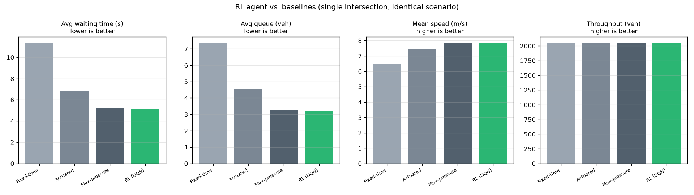

# SmartFlow: Reinforcement Learning for Adaptive Traffic-Signal Control

**SmartFlow** studies whether a deep reinforcement-learning (RL) agent can
control a signalized intersection more effectively than the fixed-time and
actuated controllers used in practice. We cast isolated-intersection signal
control as a Markov Decision Process, train a Deep Q-Network (DQN) agent inside
the [SUMO](https://www.eclipse.dev/sumo/) microscopic traffic simulator, and
benchmark it against three non-learning controllers under identical, randomized
demand. The learned policy reduces mean vehicle waiting time by **≈ 55 %** versus
a fixed-time plan and **≈ 25 %** versus SUMO's gap-based actuated controller,
while sustaining the highest throughput. The trained policy is served through a
FastAPI inference layer and complemented by a React dashboard and an ESP32 + RFID
module for emergency-vehicle preemption.

> Full methodology, training curves, ablations, and the inference API are
> documented in **[`backend/README.md`](backend/README.md)**.

---

## 1. Motivation

Most urban intersections run *fixed-time* plans that cannot react to fluctuating
demand, or *actuated* controllers that extend a green from local vehicle gaps but
optimize no network-level objective. Both leave measurable delay unaddressed when
demand is asymmetric or bursty. Reinforcement learning offers a principled
alternative: rather than hand-tuning timings, an agent learns a control policy
directly from the objective of interest — minimizing delay and queueing — by
interacting with a high-fidelity simulator. SmartFlow implements and rigorously
evaluates this idea on a single intersection, prioritizing reproducibility and an
honest comparison against strong baselines over headline numbers.

## 2. Problem formulation

We model the intersection as a Markov Decision Process (MDP) and solve it with a
single-agent [Gymnasium](https://gymnasium.farama.org/) environment built on
[sumo-rl](https://github.com/LucasAlegre/sumo-rl).

**State** — `s_t ∈ [0, 1]^19`. A one-hot encoding of the active green phase (2),
a binary flag for whether the minimum-green interval has elapsed (1), and the
normalized per-lane vehicle density (8) and halting-queue ratio (8) over the eight
incoming lanes.

**Action** — `a_t ∈ {NS-green, EW-green}`. The agent selects the next green
phase; the environment inserts the mandatory yellow transition and enforces
minimum/maximum green, so the policy reasons about *which* movement to serve
rather than low-level timing.

**Reward** — a hybrid of responsiveness and standing congestion:

```
r_t = (W_{t-1} − W_t) − α · q̄_t ,    α = 0.5
```

where `W_t` is the total accumulated waiting time and `q̄_t` the mean normalized
queue. The first term credits the action for reducing delay; the second is a
dense, bounded penalty that discourages starving a congested approach and keeps
the reward scale stable across demand levels. The pure delta-waiting-time term is
retained as a documented baseline reward.

## 3. Experimental setup

- **Network & demand.** A four-way intersection, two lanes per approach
  (13.9 m/s ≈ 50 km/h), compiled with SUMO's `netconvert`. Demand is generated
  with `randomTrips` under a fixed seed, yielding ≈ 2,050 vehicles over one
  simulated hour with randomized origin–destination pairs.
- **Agent.** DQN (Stable-Baselines3) with an MLP policy `[128, 128]`, trained for
  100,000 environment steps (≈ 41 min on a single CPU core) under a fixed seed.
  Episode return improves from ≈ −11 (random policy) to ≈ −7.9.
- **Baselines.** *(i)* **Fixed-time** — SUMO's static cyclic plan; *(ii)*
  **Actuated** — SUMO's gap-based adaptive controller; *(iii)* **Max-pressure** —
  an online heuristic that serves the approach with the greatest queued demand.
- **Metrics.** Per-vehicle waiting time, time-loss, and throughput are read from
  SUMO `tripinfo`; queue length and mean speed are time-averaged over the
  episode. All controllers run through one identical evaluation harness.
- **Protocol.** Results are averaged over three evaluation seeds (42, 7, 123).

## 4. Results

**Table 1.** Mean performance over three seeds (single intersection, one-hour
randomized demand). Arrows indicate the improving direction.

| Controller       | Avg waiting (s) ↓ | Avg time-loss (s) ↓ | Avg queue (veh) ↓ | Mean speed (m/s) ↑ | Throughput (veh) ↑ |
|------------------|------------------:|--------------------:|------------------:|-------------------:|-------------------:|
| Fixed-time       |             11.37 |               21.49 |              7.37 |               6.48 |             2048.7 |
| Actuated (SUMO)  |              6.87 |               16.39 |              4.55 |               7.41 |             2050.0 |
| Max-pressure     |              5.28 |               14.50 |              3.27 |               7.82 |             2050.7 |
| **RL (DQN)**     |          **5.14** |           **14.31** |          **3.19** |           **7.86** |         **2054.0** |

<p align="center">
  
  <br>
  <em>Figure 1 — The DQN agent against the three baselines on waiting time, queue
  length, mean speed, and throughput.</em>
</p>

The learned policy outperforms both deployed-style controllers by a wide margin
(−55 % waiting versus fixed-time, −25 % versus actuated) and additionally attains
the highest throughput and mean speed. Against **max-pressure** the margin is
small and expected: on an *isolated* intersection a well-tuned pressure heuristic
is already near-optimal, so matching it — while leading on throughput and speed —
is the informative outcome. The agent is genuinely state-dependent rather than
degenerate: across 300 decisions it switched phase 140 times and served the
more-congested direction 63 % of the time, trading switching cost against queue
instead of acting myopically.

**Emergency preemption.** Wrapping any base controller with the RFID-triggered
preemption policy reduces the emergency vehicle's waiting time from **11.0 s to
0.0 s** in the demonstrated scenario, with the underlying controller resuming
immediately afterward.

## 5. System architecture

```
   ┌──────────────┐   state s_t    ┌──────────────┐   action a_t   ┌──────────────┐
   │  SUMO traffic │ ─────────────▶ │  DQN policy   │ ─────────────▶ │  SUMO signal  │
   │  microsim     │ ◀───────────── │  (SB3 / torch)│ ◀───────────── │  (phase set)  │
   └──────────────┘   reward r_t    └──────────────┘   s_{t+1}, r_t  └──────────────┘
                                            │ trained policy (results/dqn_v1.zip)
                                            ▼
        ┌───────────────────┐   /predict · /simulate · /metrics · /health
        │  FastAPI service   │ ◀──────────────  React dashboard (frontend/)
        └───────────────────┘   ◀──────────────  ESP32 + RFID preemption trigger (hardware/)
```

The training loop couples SUMO and the agent; the serialized policy is loaded by
a FastAPI service that returns signal decisions and runs evaluation episodes on
demand. The React dashboard consumes the API, and the ESP32/RFID firmware
supplies the real-world preemption signal.

## 6. Repository structure

| Path | Description |
|------|-------------|
| [`backend/`](backend/README.md) | RL model, SUMO environment, baselines, evaluation harness, and the FastAPI inference service |
| [`frontend/`](frontend/) | React + Vite web dashboard |
| [`hardware/`](hardware/) | ESP32 + RFID firmware for emergency-vehicle preemption |

## 7. Reproducibility

**Prerequisite:** [SUMO 1.22+](https://sumo.dlr.de/docs/Installing) with
`SUMO_HOME` set.

```bash
git clone https://github.com/Kcodess2807/SMARTFLOW.git
cd SMARTFLOW
python -m venv .venv && . .venv/Scripts/activate     # macOS/Linux: . .venv/bin/activate
pip install -r backend/requirements.txt

cd backend
python -m rl.train    --algo dqn --timesteps 100000  # train (≈ 41 min, CPU) -> artifacts/
python -m rl.evaluate --model results/dqn_v1.zip --seeds 42 7 123   # reproduce Table 1
python -m pytest tests/ -q                           # unit tests
uvicorn api.main:app --reload                        # serve the inference API at :8000
```

A pre-trained policy ships in `backend/results/`, so evaluation and the API run
without retraining. The frontend runs with `cd frontend && bun install && bun run dev`.

## 8. Limitations and scope

- **Competitive, not dominant, over strong heuristics.** On the single
  intersection *and* a 2×2 multi-agent grid (parameter-sharing PPO), the policy
  clearly beats fixed-time (~46–55 %) and matches max-pressure, but does not beat
  SUMO's actuated controller on the grid. Full grid study and analysis:
  [`backend/README.md`](backend/README.md).
- **Coordination-favorable demand is the next lever.** The grid uses uniformly
  random demand, which lacks the sustained directional platoons where coordinated
  green-waves would let learning pull ahead.
- **Simulated demand.** Traffic is randomized via `randomTrips` rather than drawn
  from a measured dataset, so absolute figures are scenario-specific.
- **Compute budget.** 100k steps (single) / 200k (grid) on CPU; longer schedules,
  hyperparameter search, or a coordination-aware reward may improve the agent.

## 9. Roadmap

- **Larger networks + arterial demand:** scale the multi-agent grid (e.g. 4×4)
  with directional/platooned flow — the regime where coordinated RL is expected to
  surpass actuated and max-pressure control.
- **Perception-to-control bridge:** feed live camera-based lane counts (e.g.
  YOLO detection) into the RL state for on-street deployment.
- **Edge deployment** of the trained policy onto IoT-class hardware.

## 10. Technology

| Layer | Stack |
|-------|-------|
| RL & simulation | SUMO 1.22 · sumo-rl · Gymnasium · Stable-Baselines3 (DQN) · PyTorch |
| Inference API   | FastAPI · Pydantic · Uvicorn · Docker |
| Frontend        | React · Vite · TypeScript · Tailwind |
| Hardware        | ESP32 · RFID (C++ / Arduino) |

## References

1. P. A. Lopez et al. *Microscopic Traffic Simulation using SUMO.* IEEE ITSC, 2018.
2. L. N. Alegre. *SUMO-RL.* https://github.com/LucasAlegre/sumo-rl, 2019.
3. A. Raffin et al. *Stable-Baselines3: Reliable Reinforcement Learning Implementations.* JMLR, 2021.
4. V. Mnih et al. *Human-level control through deep reinforcement learning.* Nature, 2015.
5. P. Varaiya. *Max pressure control of a network of signalized intersections.* Transportation Research Part C, 2013.

## Team

A collaborative project spanning the reinforcement-learning backend and inference
API, the React frontend, and the ESP32/RFID firmware. Individual contributions
are visible in the repository's commit history.
