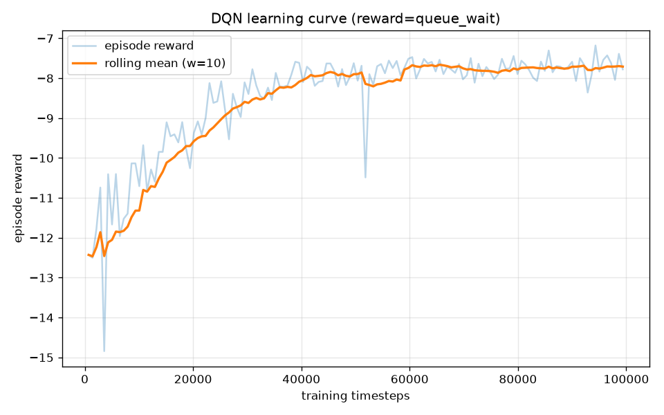

# SmartFlow — RL Traffic-Signal Control (Backend)

Adaptive traffic-signal control for a road intersection, trained with deep
reinforcement learning in the [SUMO](https://www.eclipse.dev/sumo/) traffic
simulator and served behind a FastAPI inference API.

> **Scope of this README.** This documents my contribution: the **RL model, the
> SUMO environment, the evaluation against classical baselines, and the
> inference API**. The `smartflo-web` and `smartflo-mobile` apps are teammates'
> work and are not covered here.

---

## TL;DR — what it does and how well

A DQN agent decides, in real time, which green phase to run at an intersection,
based on per-lane queues and densities. Trained and evaluated entirely in SUMO
against three non-learning controllers on **identical** traffic, it cuts average
vehicle waiting time **~55% vs. a fixed-time plan** and **~25% vs. SUMO's
actuated controller**, and edges out a max-pressure heuristic while moving the
most vehicles.

| Controller   | Avg wait (s) ↓ | Avg time-loss (s) ↓ | Avg queue (veh) ↓ | Mean speed (m/s) ↑ | Throughput (veh) ↑ |
|--------------|---------------:|--------------------:|------------------:|-------------------:|-------------------:|
| Fixed-time   | 11.37 | 21.49 | 7.37 | 6.48 | 2048.7 |
| Actuated     |  6.87 | 16.39 | 4.55 | 7.41 | 2050.0 |
| Max-pressure |  5.28 | 14.50 | 3.27 | 7.82 | 2050.7 |
| **RL (DQN)** |  **5.14** | **14.31** | **3.19** | **7.86** | **2054.0** |

*Mean over 3 evaluation seeds (42, 7, 123), single intersection, 1-hour
randomized demand (~2050 vehicles). Numbers are produced by
[`rl/evaluate.py`](rl/evaluate.py); see [results/](results/).*


> **Every number above and below comes from a real run on this machine.** There
> are no hand-set or illustrative figures. Re-running the commands reproduces
> them (fixed seeds).

---

## The problem this fixes

The original project framed signal control as RL but **the agent's action was
never actually applied** — the lights advanced on a fixed wall-clock timer and
the chosen action was ignored
([`legacy/old_rl_controller/traffic_env.py`](../legacy/old_rl_controller/traffic_env.py),
`step()`). The "agent" controlled nothing, so its reward could not respond to
its decisions and no learning signal was meaningful.

Migrating to SUMO fixes this at the root: `env.step(action)` **physically
switches the SUMO traffic-light phase** to the one the agent selected (after
enforcing a yellow transition and minimum green), and the reward is computed
from the resulting simulation state. The agent genuinely controls the
intersection.

---

## The MDP

The control problem is modelled as a Markov Decision Process and solved with a
single-agent Gymnasium environment built on
[sumo-rl](https://github.com/LucasAlegre/sumo-rl).

* **State** `Box(19)` — for the controlled intersection:
  `[ phase one-hot (2), min-green-satisfied flag (1), per-lane density (8),
  per-lane queue (8) ]`, all normalised to `[0,1]`.
* **Action** `Discrete(2)` — activate **NS-green** or **EW-green** next. sumo-rl
  inserts the yellow transition and enforces min/max green automatically, so the
  agent only chooses *which movement to serve*.
* **Reward** — `queue_wait` (custom, default): the per-step improvement in total
  accumulated waiting time **minus** a bounded standing-queue penalty:

  ```
  r_t = (W_{t-1} − W_t) − α · mean_normalised_queue_t        (α = 0.5)
  ```

  The first term responds directly to the action; the second is a dense, bounded
  signal that discourages starving a congested approach and keeps the reward
  scale stable across demand levels. The built-in `diff-waiting-time` (just the
  first term) is the documented starting point and is available via
  `--reward diff-waiting-time`. Rationale in
  [`rl/rewards.py`](rl/rewards.py).

---

## Architecture

```
                 ┌──────────────────────────── training ────────────────────────────┐
                 │                                                                    │
   ┌─────────┐   │   state s_t      ┌───────────────┐   action a_t   ┌────────────┐   │
   │  SUMO    │──┼─────────────────▶│  DQN policy    │───────────────▶│  SUMO env   │   │
   │ traffic  │  │   (queues,       │ (Stable-       │  (set green    │ (sumo-rl)   │   │
   │ sim      │◀─┼───────────────── │  Baselines3)   │◀───────────────│ applies it) │   │
   └─────────┘   │   reward r_t     └───────────────┘   r_t, s_{t+1}  └────────────┘   │
                 │        ▲   learning curve → results/learning_curve.png              │
                 └────────┼───────────────────────────────────────────────────────────┘
                          │ trained policy (results/dqn_v1.zip)
                          ▼
                 ┌───────────────────┐     POST /predict  {densities, queues, phase}
                 │  FastAPI service   │◀──────────────────────────────────────────────
                 │  api/main.py       │     POST /simulate · GET /metrics · GET /health
                 │  (loads policy)    │──────────────────────────────────────────────▶
                 └───────────────────┘     {action, phase, switch}
```

---

## Results in detail

### Training (the AI showcase)

* Algorithm: **DQN** (`MlpPolicy`, `[128,128]`), Stable-Baselines3 2.6.0.
* **100,000** timesteps, fixed **seed 42**, ~41 min on CPU (single core, no GPU).
* Episode reward improved from **≈ −11** (random) to **≈ −7.9**; TensorBoard logs
  + the learning curve are produced automatically.



One command, reproducible:

```bash
python -m rl.train --algo dqn --timesteps 100000 --tag v1     # PPO also supported: --algo ppo
tensorboard --logdir artifacts/logs                            # optional
```

### Baselines & evaluation (what makes it credible)

Three classical controllers are implemented and run through the **same** harness
on the **same** scenarios and seeds ([`rl/baselines/`](rl/baselines/)):

* **Fixed-time** — SUMO's static cyclic plan (no adaptation).
* **Actuated** — SUMO's built-in gap-based actuated control (a strong adaptive
  baseline).
* **Max-pressure** — greedy heuristic that serves the approach with the most
  queued vehicles, decided online.

Metrics come from SUMO `tripinfo` (per-vehicle waiting time, time-loss,
throughput) plus time-averaged network queue/speed — not from the reward.

```bash
python -m rl.evaluate --model results/dqn_v1.zip --seeds 42 7 123
```

### Honest reading of the numbers

* The RL agent **clearly beats fixed-time and actuated** control.
* Against **max-pressure** the gap is small (5.14 vs 5.28 s wait). On a *single
  isolated* intersection a well-tuned heuristic is already near-optimal, so this
  is expected — the RL agent matches it and additionally achieves the best
  throughput and speed. The case where learning is expected to pull clearly
  ahead is **coordinated multi-intersection** control (see Limitations).
* The agent is genuinely state-responsive, not a constant policy: over 300
  decisions it switched phase 140 times and served the more-congested direction
  63% of the time (it trades switching cost against queue rather than acting
  myopically).

---

## Emergency-vehicle preemption (hardware tie-in)

An emergency vehicle (SUMO `vClass="emergency"`, standing in for an RFID-tagged
vehicle) triggers **signal preemption**: the controller detects it on an approach
and serves that approach's green, wrapping *any* base controller
([`rl/preemption.py`](rl/preemption.py)).

```bash
python -m rl.emergency_demo            # base = max-pressure
```

Real result (seed 42): the emergency vehicle's waiting time drops from
**11.0 s → 0.0 s** when preemption is enabled.

**Hardware path.** The ESP32 + RFID firmware in [`../hardware/`](../hardware/)
reads a tagged vehicle and raises a signal over USB serial; that serial event is
the real-world trigger for exactly this override. The SUMO scenario is the
digital twin used to develop and validate the preemption logic before
deployment. (The firmware is a teammate-adjacent component, kept as-is.)

---

## The inference API (backend showcase)

A layered FastAPI service ([`api/`](api/)) loads the trained policy and exposes:

| Method | Path        | Purpose |
|--------|-------------|---------|
| GET    | `/health`   | liveness + whether the policy is loaded |
| POST   | `/predict`  | given a traffic state, return the agent's signal decision |
| POST   | `/simulate` | run an episode under a controller, return real metrics |
| GET    | `/metrics`  | latest saved RL-vs-baselines comparison |

Input is validated with pydantic (lane counts, value ranges); the layers are
split into `schemas.py` (contract) / `service.py` (model + SUMO) / `main.py`
(HTTP), with logging and error handling.

```bash
uvicorn api.main:app --port 8000      # from backend/, project venv

curl -s localhost:8000/health
# {"status":"ok","model_loaded":true,...}

curl -s -X POST localhost:8000/predict -H "Content-Type: application/json" \
  -d '{"densities":[0.8,0.7,0.1,0.1,0.8,0.7,0.1,0.1],
       "queues":[0.7,0.6,0.0,0.0,0.7,0.6,0.0,0.0],
       "current_phase":1,"min_green_elapsed":true}'
# {"action":0,"phase":"NS-green","switch":true}   <- heavy NS queue -> switch to serve it
```

Container:

```bash
docker build -t smartflow-api backend/
docker run -p 8000:8000 smartflow-api
```

---

## Reproduce from scratch

```bash
# 0. Prerequisite: SUMO 1.22 installed + SUMO_HOME set
#    (https://sumo.dlr.de/docs/Installing) — or: pip install eclipse-sumo==1.22.0

git clone <repo> && cd SMARTFLOW
python -m venv .venv && . .venv/Scripts/activate     # Windows; use bin/activate on *nix
pip install -r backend/requirements.txt

cd backend
python -m rl.train    --algo dqn --timesteps 100000 --tag v1   # ~40 min CPU -> artifacts/models/dqn_v1.zip
python -m rl.evaluate --model artifacts/models/dqn_v1.zip --seeds 42 7 123
python -m rl.emergency_demo
python -m pytest tests/ -q                                      # fast unit tests
# optional demo clip (opens sumo-gui): python -m rl.record_gif --model artifacts/models/dqn_v1.zip
```

A pre-trained policy is shipped in [`results/dqn_v1.zip`](results/) so the API
runs without training first.

---

## Layout

```
backend/
├── rl/
│   ├── nets/            SUMO scenario: single.{nod,edg,net,rou,sumocfg}.xml + actuated variant
│   ├── env.py           single-agent SumoEnvironment factory (the bug fix lives here)
│   ├── rewards.py       custom queue_wait reward + rationale
│   ├── train.py         DQN/PPO training, TensorBoard, learning curve  (Phase 2)
│   ├── evaluate.py      RL vs baselines, tripinfo metrics, table + plot (Phase 3)
│   ├── baselines/       fixed_time · actuated · max_pressure
│   ├── preemption.py    emergency-vehicle signal priority               (Phase 5)
│   ├── emergency_demo.py / record_gif.py / signal_utils.py / config.py
├── api/                 FastAPI service: schemas · service · main        (Phase 4)
├── scenarios/emergency/ emergency-vehicle preemption scenario
├── results/             published artifacts: model, plots, comparison table
├── tests/               fast unit tests (+ slow SUMO smoke test)
├── Dockerfile           API container
└── requirements.txt     pinned, mutually-compatible stack

../legacy/    archived pygame sim, darkflow, old duplicate scripts, buggy old RL env
../hardware/  ESP32 + RFID firmware (kept as-is)
```

---

## Limitations (honest)

* **Single intersection.** This is one intersection with two phases. A
  multi-intersection grid (sumo-rl's PettingZoo multi-agent API) is the natural
  next step and where RL should clearly outpace per-junction heuristics.
* **RL ≈ max-pressure here.** As noted, the learned policy's margin over
  max-pressure is small on an isolated junction; the win over deployed-style
  fixed-time/actuated control is the meaningful result.
* **Synthetic demand.** Traffic is randomized (`randomTrips`, seed 42), not from
  a real traffic dataset; absolute numbers are scenario-specific.
* **CPU, modest budget.** 100k steps on CPU. More steps / hyperparameter search
  / PPO comparison would likely improve the agent further.
* **Tech stack.** SUMO 1.22 · sumo-rl 1.4.5 · Stable-Baselines3 2.6.0 ·
  Gymnasium 1.1.1 · PyTorch 2.5.1 (CPU) · FastAPI. Pinned in
  [`requirements.txt`](requirements.txt).

## Credits

RL model, SUMO environment, evaluation, and API: this contribution. Web app
(`smartflo-web`) and mobile app (`smartflo-mobile`): teammates. ESP32/RFID
firmware (`hardware/`): retained from the original project.
